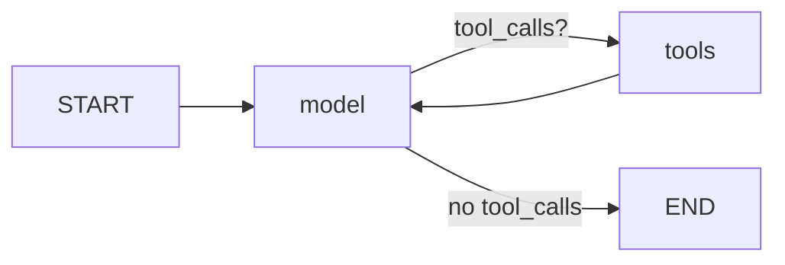

# RepSense — AI-First CRM · HCP Log Interaction Module

> An AI-first **Log Interaction** screen where a field rep never has to touch the form —
> a **LangGraph** agent fills, amends, and *refuses to file* a regulated call report. The rep
> just chats; the structured form fills itself in real time.

**Stack:** React + Redux · FastAPI · **LangGraph** + **Groq** LLM · PostgreSQL · Google Inter.

---

## 1. This screen is a call report, not a note

A pharma field rep's interaction log is a **regulated call report**, not a text box. Every field
on it is a compliance object: *HCP Name* ties the record to a territory and an NPI for Open Payments
attribution; *Materials Shared* is proof only MLR-approved assets were used; *Samples Distributed*
is a PDMA legal record; *"Observed/Inferred Sentiment"* measures the rep's perception, not the
doctor. So the AI's job on this screen is to **constrain, not to generate** — it has two verbs,
**classify** and **select** — and the guardrails are **tool contracts and database constraints,
not a paragraph in a prompt.**

That one idea drives every design decision below.

---

## 2. Quickstart

**Prerequisites:** Python **3.11+**, Node **18+**, and either Docker (for Postgres) or a local
PostgreSQL 16. A **Groq API key** (free — create one at <https://console.groq.com/keys>).

```bash
# 0. clone, then from the repo root:
cp .env.example .env
#    edit .env and set GROQ_API_KEY=gsk_...   (the models default to openai/gpt-oss-120b / 20b)

# 1. Database (Docker path — schema auto-loads from init.sql on first boot)
docker compose up -d db
#    …or use a local Postgres 16: createdb repsense && psql -d repsense -f backend/app/db/init.sql

# 2. Backend
cd backend
python3.11 -m venv .venv && source .venv/bin/activate
pip install -r requirements.txt
python scripts/seed.py                 # load the demo dataset
uvicorn app.main:app --reload --port 8000

# 3. Frontend (new terminal)
cd frontend
npm install
npm run dev                            # http://localhost:5173
```

Open **<http://localhost:5173>** and type into the AI Assistant on the right, e.g.
*"Met Dr. Priya Sharma at Apollo this morning, went really well, discussed OncoBoost OASIS efficacy
and left her the Phase III reprint."* The form fills itself.

- `GET /api/health` — liveness + DB + key status
- `GET /api/model-info` — the whole model story as JSON (see §7)
- `POST /api/demo/reset` — truncate + re-seed (clean stage between demo takes)
- API docs: `http://localhost:8000/docs`

---

## 3. Role of the LangGraph Agent in Managing HCP Interactions

The LangGraph agent is the **single interface** through which a rep logs and amends HCP
interactions by conversation. It is a tool-calling ReAct agent built with LangChain v1's
`create_agent` (compiling to a LangGraph `StateGraph` with `model` and `tools` nodes) and a
**Postgres checkpointer** keyed by `thread_id`, so one conversation is one durable, resumable
session.

Its responsibilities in managing HCP interactions:

1. **Entity extraction & summarization** — it reads the rep's free text and extracts the
   structured call-report fields (HCP, interaction type, topics, sentiment, materials, outcomes),
   summarizing the discussion. This is the LLM's core job on the *Log Interaction* tool.
2. **Multi-hop orchestration, not routing** — it *decides* which tools to call and in what order.
   Because `log_interaction` requires a **resolved** `hcp_id`, "Met Dr. Sharma" cannot be satisfied
   in one call: the agent must first `resolve_hcp`, then (if a material was shared)
   `check_product_material`, then `log_interaction`. The chain emerges from tool contracts, not a
   hardcoded sequence.
3. **Stateful correction** — it carries a structured `form` draft in graph state across turns via a
   custom reducer, so the rep can say *"actually it went badly"* and the agent resolves the
   anaphora against the checkpointed record and calls `edit_interaction`.
4. **Compliance gatekeeping** — it will not file an AI-inferred sentiment until the rep confirms it,
   routes off-label questions to Medical Affairs, and surfaces (never silently drops) rejected
   writes. The hard guarantees live below the agent in tool contracts and DB constraints; the agent
   is the last line of defense, not the first.



The `form` object the agent maintains is **one JSON shape with five homes** and zero mapping
layers: `LLM tool args → graph state["form"] → SSE form_patch → Redux formDraft.values →
Postgres interaction_versions.snapshot (JSONB)`. That is why *"the chat fills the form"* and
*"the record amends itself"* are the same mechanism, and why the spec's *"structured form **or**
conversational chat"* is one state machine with two writers.

---

## 4. The Tools

The brief requires a **minimum of five** tools; **this ships six** (plus a seventh, `get_hcp_history`).
The two mandated tools are **Log Interaction** and **Edit Interaction**.

| # | Tool | Inputs | Output | What it does |
|---|------|--------|--------|--------------|
| 1 | **`log_interaction`** *(mandated)* | `commit`, `hcp_id`, `interaction_type`, `summary_text`, `sentiment`, `materials_shared`, `outcomes`, … | `Command(form patch, flags, ToolMessage)` | **Captures interaction data** — the LLM extracts entities/summary and patches the live form. `commit=true` files an **immutable, locked v1**. Refuses to file an unconfirmed inferred sentiment, a record missing an HCP, or one carrying a safety signal. |
| 2 | **`edit_interaction`** *(mandated)* | `changed_fields` (dotted paths), `reason_for_change`, `reason_code` | `Command(form patch, ToolMessage(diff))` | **Modifies logged data** — appends an audited **version N+1** with a mandatory reason; never a destructive UPDATE. v1 is retained verbatim. |
| 3 | `resolve_hcp` | `query_text`, `territory_id` (server-injected) | `{candidates[], action_required}` | Resolves a spoken name to a canonical HCP master record. **Fails closed:** never invents an HCP, withholds out-of-territory records, and returns `DISAMBIGUATE` on a name collision so the agent asks instead of guessing. |
| 4 | `check_product_material` | `product` (brand or id), `channel`, `country` | `{approved_materials[], filtered_out[{reason}]}` | Gates *Materials Shared* to currently **MLR-approved** assets. Returns excluded assets **with reasons** (expired / withdrawn) so the filter is visible, not silent. |
| 5 | `record_sample_distribution` | `hcp_id`, `product`, `lot_number`, `quantity`, `signature_ref?` | `{status, compliance_result, rejection_reason?}` | Creates the **PDMA** disbursement record. Five hard-fails (expired lot, lot not in reconciled inventory, non-prescriber recipient, annual-limit breach, missing signature). A REJECT blocks **SUBMIT**, not DRAFT — the rep keeps their work. |
| 6 | `suggest_follow_ups` | `hcp_id`, `product_id?` | `{suggestions[]}` | Produces the *AI Suggested Follow-ups* chips as **constrained selection** — a closed action enum, and `send_approved_material` targets validated against the approved-material set. Off-label questions route to `route_medical_inquiry_to_MSL`. Uses Groq **Structured Outputs** (json_schema, strict). |
| 7 | `get_hcp_history` | `hcp_id`, `lookback_days` | `{interactions[], aggregates}` | Prior calls + YTD aggregates (territory access enforced in SQL) so follow-ups are contextual. |

---

## 5. Model mandate: why this repo does not run `gemma2-9b-it`

**The brief names two Groq models. Both are unusable as specified — and this repo can prove it.**

`gemma2-9b-it` was announced deprecated by Groq on **2025-08-08** and **decommissioned on
2025-10-08**. Any request naming it returns **HTTP 400 / `code: model_decommissioned`**.
`scripts/prove_gemma_dead.py` makes the call and prints the live error:

```
$ python scripts/prove_gemma_dead.py
groq.BadRequestError: Error code: 400 - {'error': {'message': 'The model `gemma2-9b-it` has been
  decommissioned and is no longer supported. Please refer to
  https://console.groq.com/docs/deprecations …', 'code': 'model_decommissioned'}}
```

Separately — and this matters for a LangGraph brief — `gemma2-9b-it` was never a *reliable*
tool-caller even when it was live: Gemma 2's chat template has no tool-use special tokens, so
Groq's tool path for it was a prompted shim, not a trained capability. **So the brief's three
mandates — LangGraph, tool calling, and `gemma2-9b-it` — were never simultaneously satisfiable, and
are not satisfiable at all today. This repo does not deviate from the spec; it resolves a
contradiction inside it.**

The brief's second model, `llama-3.3-70b-versatile`, *is* live and supports tool calling, but Groq
announced its deprecation on 2026-06-17 with shutdown **2026-08-16** — a bad default for a repo a
reviewer might clone next month. It ships as a documented `GROQ_AGENT_MODEL` override.

**What this repo runs:** `openai/gpt-oss-120b` (tool-calling agent) and `openai/gpt-oss-20b`
(constrained extraction). As of 2026-07-15 these are the only Groq IDs that are simultaneously
production-tier, undeprecated, custom-tool-calling capable, and strict-`json_schema` capable —
and `gpt-oss-120b` is the terminal replacement target on Groq's own deprecation table for nearly
every retired model. Both spec model strings are present, dated, in `.env.example`, and the app
handles the dead one gracefully: set `GROQ_AGENT_MODEL=gemma2-9b-it`, restart, and `preflight_model()`
catches Groq's error, routes to `gpt-oss-20b`, and shows an amber banner. `GET /api/model-info`
returns the whole story as JSON.

*Transferable lesson: Groq's own tool-use docs page — and LangChain's ChatGroq quickstart — still
advertise models that are on the deprecation table. Never pick a model ID from an integration page
without cross-checking `/docs/deprecations`. The model ID is one env var with one dated comment, so
the next rotation is a config change, not a code change.*

---

## 6. Compliance & Guardrails (the domain layer)

Compliance is a **schema invariant**, not a convention:

- **Append-only audit trail (21 CFR Part 11).** The `interactions` header holds **no rep-authored
  content** — every rep-authored field lives only in `interaction_versions.snapshot` (JSONB), which
  is append-only by a `RAISE`ing trigger. There is no column for a destructive
  `UPDATE interactions SET sentiment=…` to hit, and the DB refuses any UPDATE/DELETE on a filed
  version. Try it: `UPDATE interaction_versions …` → `ERROR: append-only … (21 CFR Part 11)`.
- **The "why" is enforced.** A `CHECK` requires a ≥10-char `reason_for_change` on every amendment.
- **Inferred sentiment is provenance-tracked.** A `model_inferred` sentiment cannot be filed without
  a verbatim `rationale_quote` (a `CHECK`) and the rep's confirmation (the agent refuses otherwise).
  Sentiment defaults to **UNSET, never Neutral** — a default Neutral would launder a guess as an
  observation about a named physician.
- **`(Requires Consent)` is a constraint, not helper text.** A `CHECK` rejects voice provenance
  without a `consent_ref`.
- **MLR gating & off-label.** The agent may only *select* approved materials, and off-label HCP
  questions route to Medical Affairs — it never answers them.
- **PDMA vs Sunshine.** Samples (`sample_transactions`, write-once) and transfers of value
  (`transfers_of_value`) are deliberately separate tables — two regimes, not one.
- **Least privilege.** The app connects as a non-superuser `app_user` with `REVOKE UPDATE, DELETE`
  on the append-only tables, on top of the triggers.

---

## 7. Architecture & project structure

```
backend/                     FastAPI + LangGraph
  app/
    agent/       graph.py (create_agent) · state.py (merge_form reducer) · middleware.py
                 prompt.py · fallback.py (extract_fallback) · llm.py · tools/ (7 tools)
    services/    interaction · hcp · material · sample · followup · compliance · audit
    api/         chat.py (SSE) · interactions.py (REST form path) · refdata.py · ops.py
    db/          init.sql (schema+triggers+CHECKs) · seed.sql · session.py
    config.py · schemas.py · model_preflight.py · main.py
  scripts/       prove_gemma_dead.py · seed.py
  tests/         services/ (14 tests) · test_agent_gate.py (two-turn agent gate)
frontend/                    React 19 + Redux Toolkit + Vite + Tailwind v4
  src/store/     formDraftSlice (single source of truth) · chatSlice · agentSlice
  src/api/       stream.ts (fetch + eventsource-parser SSE client)
  src/components/ FormPanel · ChatPanel · VersionDrawer · Field
docker-compose.yml           Postgres 16 (DB only)
```

**Transport:** the whole app hangs off `POST /api/chat/stream` (SSE). SSE, not WebSocket — nothing
flows client→server mid-stream, so it's strictly simpler. The stream multiplexes token deltas,
`form_patch`, `tool_call`, `compliance_flag`, `clarify`, `suggestions`, `filed`/`amended`, and
`error` events, each mapped 1:1 to a Redux action. Tokens are buffered on `requestAnimationFrame`.

**Structured form OR chat.** The spec wants either; both are complete and share one service layer,
so they cannot drift. There is **no PUT and no PATCH** on `/interactions` — amendment is the only
write path to a filed record.

---

## 8. Design decisions & trade-offs

- **`create_agent` over a hand-rolled `StateGraph`.** Compliance belongs in tool contracts and DB
  constraints, so the prebuilt agent + middleware suffices; a custom graph would add risk for no
  guarantee it doesn't already provide.
- **Structured Outputs vs tool use.** Groq forbids combining `response_format` with tool use or
  streaming, so the one structured call (`suggest_follow_ups` / `extract_fallback`) is a separate,
  non-streamed, non-tool-bound call on `gpt-oss-20b`. This split was designed in from the start.
- **Two-way binding.** Redux is the single source of truth; the agent never calls `setValue`. User
  edits mark a field `touchedByUser`, and the agent-patch reducer skips touched fields, surfacing
  its value as an *Accept / Keep mine* chip. User always wins — visibly.
- **`recursion_limit=20` on every invoke** (LangGraph's default is ~10 000) so a stuck loop can't
  burn the free-tier token budget.

---

## 9. Limitations & future work

- **Voice transcription is stubbed.** The consent gate, the DB constraint, and the audit trail are
  real; speech-to-text is not implemented (commodity; the *gate* was the graded idea). Default
  posture is transcribe-then-discard-audio.
- **Auth is stubbed** — one hardcoded rep (`REP-001`). But `actor_id`/`territory_id` are
  server-injected, never model-supplied, so the seam for real auth is visible.
- **Brands are fictional on purpose.** *OncoBoost* (molecule *ribocretinib*) and *CardiaSure* do not
  exist — seeding a real drug name next to an invented efficacy claim would itself be the off-label
  artifact this tool exists to prevent.
- **"Observed/Inferred Sentiment" measures the rep, not the doctor.** When a model infers it, it is
  three lossy layers removed from the HCP's actual state — which is why it defaults to unset,
  requires a quote, and cannot be filed without rep confirmation.
- Future: RBAC/multi-tenancy, the compliance-approver UI (the trigger + `requires_approval` flag
  exist), ToV capture UI + live Sunshine aggregate, deployment.

---

## 10. AI-Assisted Development

Per the brief, this project was built with AI assistance. The value was in **direction and
verification**, not typing. One concrete example: every assistant defaults to
`from langgraph.prebuilt import create_react_agent` — the pattern in essentially every tutorial in
its training data. That is **deprecated in LangGraph v1**; the current path is
`from langchain.agents import create_agent`, and it is *not* a drop-in (`prompt=` → `system_prompt=`,
hooks → `middleware=[...]`). Catching that, pinning around it, and verifying the whole stack against
the live Groq API — including proving the mandated model is dead — is the work.

---

## Tests

```bash
cd backend && pytest -q         # 14 service tests + the two-turn agent gate (needs GROQ_API_KEY)
```
